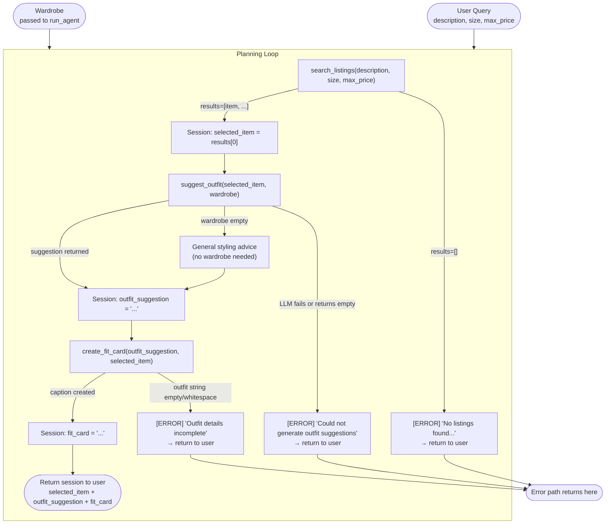

# FitFindr — planning.md

> Complete this document before writing any implementation code.
> Your spec and agent diagram are what you'll use to direct AI tools (Claude, Copilot, etc.) to generate your implementation — the more specific they are, the more useful the generated code will be.
> Your planning.md will be reviewed as part of your submission.
> Update it before starting any stretch features.

---

## Tools

List every tool your agent will use. For each tool, fill in all four fields.
You must have at least 3 tools. The three required tools are listed — add any additional tools below them.

### Tool 1: search_listings

**What it does:**
<!-- Describe what this tool does in 1–2 sentences -->
Searches the mock listings dataset using the input parameters and returns the matching items. 

**Input parameters:**
<!-- List each parameter, its type, and what it represents -->
- `description` (str):  search keywords describing the cloth user is wanting
- `size` (str): size of the cloth user desires
- `max_price` (float): maximum price the user wants

**What it returns:**
<!-- Describe the return value — what fields does a result contain? -->
A list conataining dictionaries of the best matching listings, soreted by relevance with the best matching being in the first. produced by the function. The dictionaries will have fields, id (str), title (str), description (str), category (str), style_tags (list[str]),size (str), condition (str), price (float), colors (list[str]), brand (str or None)
,platform (str). An empty list[] if no matching listings found.

**What happens if it fails or returns nothing:**
<!-- What should the agent do if no listings match? -->
1. If the tool returns an empty list, set an error message in the session: "No listings found matching your search. Try describing the item differently, increasing your budget, or removing the size filter." Return the session early.
2. Never call suggest_outfit if the tool returns an empty list.
---

### Tool 2: suggest_outfit

**What it does:**
<!-- Describe what this tool does in 1–2 sentences -->
With the found specific item and the user's current wardrobe, suggests one or more outfit combinations based on styles. 

**Input parameters:**
<!-- List each parameter, its type, and what it represents -->
- `new_item` (dict): a specific clothing item found from the listings
- `wardrobe` (dict): user's current wardrobe containing different clothes

**What it returns:**
<!-- Describe the return value -->
A non-empty string with 2-3 sentences describing specific outfit combinations. The suggestion should mention which wardrobe pieces to pair with the new item, explain color/style compatibility, and include styling tips (e.g., "roll the sleeves," "tuck slightly"). 
If the wardrobe is empty, return general styling advice for the item alone instead of failing.
Example: "Pair this faded band tee with your black baggy jeans and chunky platform sneakers for a 90s grunge vibe. The navy + black creates a moody palette. Roll the sleeves once for shape."

**What happens if it fails or returns nothing:**
<!-- What should the agent do if the wardrobe is empty or no outfit can be suggested? -->
1. If the wardrobe is empty, provide general styling advice for the item instead of crashing (e.g., "This tee works well with loose-fitting jeans and chunky sneakers for a 90s vibe.").
2. If the LLM call fails or returns an empty string, set an error in the session: "Could not generate outfit suggestions for this item." Do not call create_fit_card.
---

### Tool 3: create_fit_card

**What it does:**
<!-- Describe what this tool does in 1–2 sentences -->
Creates a Instagram/Twitter style short, shareable description of the complete outfit. 

**Input parameters:**
<!-- List each parameter, its type, and what it represents -->
- `outfit` (string): The outfit suggestion string from suggest_outfit describing how to style the item
- `new_item` (dict): The listing dictionary of the new found item form search_listings

**What it returns:**
<!-- Describe the return value -->
A short shareable caption describing the suggested outfit and the new found items description like price, color, etc. Caption like the one you can use in Instagram posts. 

**What happens if it fails or returns nothing:**
<!-- What should the agent do if the outfit data is incomplete? -->
If the outfit string is empty or just white-space, provide a descriptive message saying, "Outfit data incomplete, try suggesting the outfit first". If the LLM call fails, provide a descriptive error message instead of an exception. Do not call this tool again if suggest_outfit fails.
---

### Additional Tools (if any)

<!-- Copy the block above for any tools beyond the required three -->

---

## Planning Loop

**How does your agent decide which tool to call next?**
<!-- Describe the logic your planning loop uses. What does it look at? What conditions change its behavior? How does it know when it's done? -->
1. Extract search criteria (description, size, max_price) from the user's query. Call search_listings() with these values and wait for results.

2. Check if results are empty. If yes, tell the user "No listings found matching your search. Try describing the item differently, increasing your budget, or removing the size filter." Store this error and stop—do not proceed to suggest_outfit.

3. If results exist, take the top match as the selected item. Call suggest_outfit() with the selected item and the user's wardrobe.

4. Check if the outfit suggestion is empty or an error. If yes, tell the user "Could not generate outfit suggestions for this item." Store this error and stop—do not proceed to create_fit_card.

5. If a suggestion exists, call create_fit_card() with the outfit suggestion and the selected item.

6. Check if the caption was created successfully. If yes, return all results to the user (selected item, outfit suggestion, and caption). If no, return the error message.

---

## State Management

**How does information from one tool get passed to the next?**
<!-- Describe how your agent stores and accesses state within a session. What data is tracked? How is it passed between tool calls? -->

The agent maintains an internal data structure (a session) that persists throughout the entire interaction. This session stores three key pieces of information:

1. **Selected item** — After search_listings() returns results, the top matching item (a dictionary) is stored in the session. This same item is then retrieved and passed as input to suggest_outfit() and create_fit_card().

2. **Outfit suggestion** — After suggest_outfit() returns styling advice (a string), it is stored in the session. This string is then retrieved and passed as input to create_fit_card().

3. **Error messages** — If any tool fails or returns empty results, the error message is stored in the session instead of crashing. The agent checks for errors before proceeding to the next tool. If an error exists, the agent returns the error message to the user and stops execution.

Each tool's output is automatically available to subsequent tools without the user needing to re-enter data. The session acts as shared memory between all tools in a single conversation.
---

## Error Handling

For each tool, describe the specific failure mode you're handling and what the agent does in response.

| Tool | Failure mode | Agent response |
|------|-------------|----------------|
| search_listings | No results match the query | Tell the user: "No listings found matching your search. Try describing the item differently, increasing your budget, or removing the size filter." Do not call suggest_outfit. |
| suggest_outfit | Wardrobe is empty | Skip wardrobe-based pairing and return general styling advice instead (e.g., "This tee works well with loose-fitting dark jeans and chunky sneakers for a 90s grunge look."). Proceed to create_fit_card normally with this advice. |
| suggest_outfit | LLM call fails or returns empty string | Tell the user: "Something went wrong while generating outfit suggestions — please try your search again." Do not call create_fit_card. |
| create_fit_card | Outfit string is empty or whitespace | Tell the user: "We weren't able to build a fit card for this item. Try searching again with a different description or budget." Do not crash or retry. |

---

## Architecture

---

## AI Tool Plan

<!-- For each part of the implementation below, describe:
     - Which AI tool you plan to use (Claude, Copilot, ChatGPT, etc.)
     - What you'll give it as input (which sections of this planning.md, your agent diagram)
     - What you expect it to produce
     - How you'll verify the output matches your spec before moving on

     "I'll use AI to help me code" is not a plan.
     "I'll give Claude my Tool 1 spec (inputs, return value, failure mode) and ask it to implement
     search_listings() using load_listings() from the data loader — then test it against 3 queries
     before trusting it" is a plan. -->

**Milestone 3 — Individual tool implementations:**
1. For search_listings, I'll give Claude the Tool 1 block from planning.md (inputs, return value, failure mode) and ask it to implement the function using load_listings() from the data loader. Before running it, I'll check that the generated code filters by all three parameters and handles the empty-results case. Then I'll test it with 3 queries.

2. For suggest_outfit, I'll give Claude the Tool 2 block from planning.md (inputs, return value, failure mode) and ask it to implement the function using Groq's llama-3.3-70b-versatile. I'll verify the generated code handles the empty wardrobe case by calling it with get_empty_wardrobe() and checking it returns general styling advice rather than crashing. Then I'll test it with one full wardrobe and one empty wardrobe to confirm both paths work.

3. For create_fit_card, I'll give Claude the Tool 3 block from planning.md (inputs, return value, failure mode) and ask it to implement the function calling the LLM with a prompt that produces an Instagram-style caption. I'll verify the guard for an empty outfit string is present in the code before running it. Then I'll run it three times on the same input and confirm the output varies each time — if identical, I'll ask Claude to increase the LLM temperature.

**Milestone 4 — Planning loop and state management:**
I'll give Claude the Planning Loop and State Management sections from planning.md along with the agent diagram (Architecture section) and ask it to implement run_agent() in agent.py following the numbered TODO steps already in the file. I'll verify the generated code branches on the search_listings result (not calling suggest_outfit unconditionally), stores selected_item and outfit_suggestion in the session dict, and checks session["error"] before each subsequent tool call. I'll test the happy path by printing session["selected_item"] before and after suggest_outfit to confirm it's the same dict. I'll test the error path by running a query that returns no listings and confirming session["fit_card"] remains None.

---

## A Complete Interaction (Step by Step)

Write out what a full user interaction looks like from start to finish — tool call by tool call. Use a specific example query.

**Example user query:** "I'm looking for a vintage graphic tee under $30. I mostly wear baggy jeans and chunky sneakers. What's out there and how would I style it?"

**Step 1:**
The agent extracts `description="vintage graphic tee"`, `size=None` (no size mentioned in query), and `max_price=30.0` from the user's query, then calls `search_listings("vintage graphic tee", size=None, max_price=30.0)`.

The tool scans listings.json and filters by price ≤ $30, then ranks by keyword and style tag matches against "vintage graphic tee". Three listings match:
- `lst_006`: Graphic Tee — 2003 Tour Bootleg Style, $24, depop, tags: ["graphic tee", "vintage", "grunge", "streetwear", "band tee"] — **top result** (title and tags both match directly)
- `lst_033`: Vintage Band Tee — Faded Grey, $19, depop, tags: ["vintage", "grunge", "band tee", "graphic tee", "streetwear"]
- `lst_002`: Y2K Baby Tee — Butterfly Print, $18, depop, tags: ["y2k", "vintage", "graphic tee", "cottagecore"]

Results is non-empty, so the agent stores `session["selected_item"] = lst_006` and proceeds to Step 2.

**Step 2:**
The agent calls `suggest_outfit(new_item=session["selected_item"], wardrobe=example_wardrobe)`.

The new item is the black, boxy graphic tee (lst_006). The example wardrobe contains, among other things: baggy straight-leg jeans in dark wash (w_001), chunky white sneakers (w_007), and a vintage black denim jacket (w_006) — which the user's query already hints at ("I mostly wear baggy jeans and chunky sneakers").

The LLM returns: "Pair this boxy black graphic tee with your baggy dark-wash jeans and chunky white sneakers for a classic streetwear grunge look. Layer your vintage black denim jacket over the top to add structure. Tuck just the front corner of the tee into the waistband for shape without losing the oversized feel."

The agent stores `session["outfit_suggestion"]` with this string and proceeds to Step 3.

**Step 3:**
The agent calls `create_fit_card(outfit=session["outfit_suggestion"], new_item=session["selected_item"])`.

The LLM produces a short caption referencing the item details (black graphic tee, $24, depop) and the outfit: "grabbed this boxy 2003 bootleg tee off depop for $24 and it goes with literally everything i own. dark jeans + chunky sneakers + black denim jacket = the only fit formula i need."

The agent stores this in `session["fit_card"]` and returns the full session.

**Final output to user:**
The user sees three sections:
- **Found item:** Graphic Tee — 2003 Tour Bootleg Style | $24 | depop | condition: good | colors: black | tags: graphic tee, vintage, grunge, streetwear, band tee
- **Outfit suggestion:** "Pair this boxy black graphic tee with your baggy dark-wash jeans and chunky white sneakers for a classic streetwear grunge look. Layer your vintage black denim jacket over the top to add structure. Tuck just the front corner of the tee into the waistband for shape without losing the oversized feel."
- **Fit card:** "grabbed this boxy 2003 bootleg tee off depop for $24 and it goes with literally everything i own. dark jeans + chunky sneakers + black denim jacket = the only fit formula i need."

**Error path:** If the query were instead "designer ballgown, size XXS, under $5" — Step 1 would return an empty list (no listings in listings.json match under $5). The agent sets `session["error"] = "No listings found matching your search. Try describing the item differently, increasing your budget, or removing the size filter."` and returns immediately. `suggest_outfit` and `create_fit_card` are never called, and `session["fit_card"]` stays `None`.